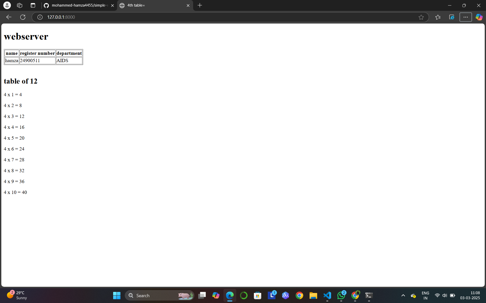

 
# EX01 Developing a Simple Webserver
## Date:

## AIM:
To develop a simple webserver to serve html pages and display the configuration details of laptop.

## DESIGN STEPS:
### Step 1: 
HTML content creation.

### Step 2:
Design of webserver workflow.

### Step 3:
Implementation using Python code.

### Step 4:
Serving the HTML pages.

### Step 5:
Testing the webserver.

## PROGRAM:
```html
<!DOCTYPE html>
<html lang="en">
<head>
    <meta charset="UTF-8">
    <meta name="viewport" content="width=device-width, initial-scale=1.0">
    <title>4th table=</title>
</head>
<body>
    <h1>webserver</h1>
    <table border="1">
        <tr> 
            <th>name</th>
            <th>register number</th>
            <th>department</th>
        </tr>
        <tr>
            <td>hamza</td>
            <td>24900511</td>
            <td>AIDS</td>
        </tr>
        
    </table>
    <br>
    <h2>table of 12</h2>
    <p>4 x 1 = 4</p>
    <p>4 x 2 = 8</p>
    <p>4 x 3 = 12</p>
    <p>4 x 4 = 16<p>
    <p>4 x 5 = 20</p>
    <p>4 x 6 = 24</p>
    <p>4 x 7 = 28</p>
    <p>4 x 8 = 32</p>
    <p>4 x 9 = 36</p>
    <p>4 x 10 = 40</p>
    
    
    
</body>
</html>
```
## OUTPUT:


## RESULT:
The program for implementing simple webserver is executed successfully.
